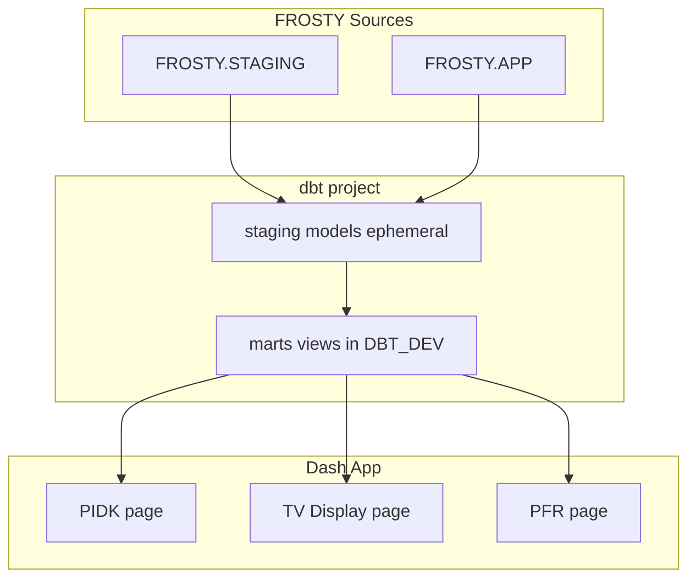

# dbt Framework Migration Plan

## Goal

Move all SQL transformations from the Dash app into dbt. Each page = one Power BI report = dbt marts. Dynamic tables become `SELECT *` staging models first; refactoring happens later. The app will only query `DBT_DEV.{mart}` with filters, not raw sources.

---

## Architecture




---

## Current State


| Component   | Status                                                                                              |
| ----------- | --------------------------------------------------------------------------------------------------- |
| **Sources** | 3 tables in `frosty_staging` (DQ_PTRUN_N_REPORT_03, VW_RUN_TOTALS_FAST_03, VW_SHIFT_TOTALS_FAST_03) |
| **Staging** | 3 ephemeral models: `stg_ptrun_report`, `stg_run_totals`, `stg_shift_totals`                        |
| **Marts**   | 2: `pidk_run_totals`, `pidk_shift_totals` (used when `USE_DBT_PIDK=true`)                           |
| **App**     | PIDK, TV, PFR still use ~25 inline SQL queries against FROSTY.STAGING and FROSTY.APP                |


---

## Phase 1: Expand Sources

**File:** [dbt/models/staging/sources.yml](dbt/models/staging/sources.yml)

**Add to `frosty_staging`:**

- `DT_SHIFT_10MIN_KPI_A_PER_RUN03_DT` — 10-min bucket KPIs (BPH chart, employee summary)
- `DQ_APPLE_SIZER_HEADER_VIEW_03` — sizer batch header/events
- `DQ_APPLE_SIZER_DROPSUMMARY_03` — sizer drop summary by grade/size
- `DQ_EQ_WITH_KEYS03` — EQ cartons with run keys
- `PACK_CLASSIFICATION` — pack abbr → classification
- `VW_LOT_DUMPER_TIME_03` — lot dumper time, `IS_CURRENT_LOT`

**Add new source `frosty_app`:**

- `POWERBI_PRODUCTION_HEADER_MAT`
- `PTRUN_SIZER_DROP_SNAPSHOT`
- `PTRUN_SIZER_PACKED`
- `PTRUN_PROCESSOR_VIEW_PBIX`
- `PTRUN_CULL_DEFECT`
- `PTRUN_PRESSURE_DETAIL`
- `PTRUN_CULL_HEADER`

---

## Phase 2: Staging Layer

All staging models stay ephemeral (`SELECT` * from source). Pattern:

```sql
{{ config(materialized='ephemeral') }}
select * from {{ source('frosty_staging', 'TABLE_NAME') }}
```

**New staging models in** [dbt/models/staging/](dbt/models/staging/):


| Model                         | Source                                     |
| ----------------------------- | ------------------------------------------ |
| `stg_shift_10min_kpi.sql`     | DT_SHIFT_10MIN_KPI_A_PER_RUN03_DT          |
| `stg_sizer_header.sql`        | DQ_APPLE_SIZER_HEADER_VIEW_03              |
| `stg_sizer_dropsummary.sql`   | DQ_APPLE_SIZER_DROPSUMMARY_03              |
| `stg_eq_with_keys.sql`        | DQ_EQ_WITH_KEYS03                          |
| `stg_pack_classification.sql` | PACK_CLASSIFICATION                        |
| `stg_lot_dumper_time.sql`     | VW_LOT_DUMPER_TIME_03                      |
| `stg_powerbi_prod_header.sql` | POWERBI_PRODUCTION_HEADER_MAT (frosty_app) |
| `stg_ptrun_sizer_drop.sql`    | PTRUN_SIZER_DROP_SNAPSHOT                  |
| `stg_ptrun_sizer_packed.sql`  | PTRUN_SIZER_PACKED                         |
| `stg_ptrun_processor.sql`     | PTRUN_PROCESSOR_VIEW_PBIX                  |
| `stg_ptrun_cull_defect.sql`   | PTRUN_CULL_DEFECT                          |
| `stg_ptrun_pressure.sql`      | PTRUN_PRESSURE_DETAIL                      |
| `stg_ptrun_cull_header.sql`   | PTRUN_CULL_HEADER                          |


---

## Phase 3: Marts per Page

### PIDK (Production Intra Day KPIs)

**Existing:** `pidk_run_totals`, `pidk_shift_totals`

**New marts in** [dbt/models/marts/production/](dbt/models/marts/production/):


| Mart                       | Purpose                     | Logic                                                                                                                          |
| -------------------------- | --------------------------- | ------------------------------------------------------------------------------------------------------------------------------ |
| `pidk_day_labels.sql`      | Day dropdown options        | `SELECT DISTINCT DAY_LABEL FROM stg_ptrun_report ORDER BY CASE WHEN DAY_LABEL = 'TODAY'...`                                    |
| `pidk_shift_10min_kpi.sql` | BPH chart, employee summary | `SELECT * FROM stg_shift_10min_kpi WHERE MINUTES_WORKED_ALLOC > 0` (app filters by DATE_SHIFT_KEY, RUN_KEY)                    |
| `pidk_run_keys.sql`        | Run keys for shift slicer   | `SELECT GROWER_NUMBER, RUN_KEY, PACKDATE_RUN_KEY, DAY_LABEL FROM stg_ptrun_report` (app filters)                               |
| `pidk_sizer_events.sql`    | Sizer batch list            | Join `stg_sizer_header` + `stg_ptrun_report` (app filters by DAY_LABEL, RUN_KEY, PACKDATE_RUN_KEY)                             |
| `pidk_sizer_drops.sql`     | Drop summary per event      | `SELECT * FROM stg_sizer_dropsummary` (app filters by EventId)                                                                 |
| `pidk_eq.sql`              | EQ matrix, package types    | Join `stg_eq_with_keys` + `stg_ptrun_report` + `stg_pack_classification` (app filters by DAY_LABEL, RUN_KEY, PACKDATE_RUN_KEY) |


### TV Display


| Mart                  | Purpose                          | Logic                                                                                                               |
| --------------------- | -------------------------------- | ------------------------------------------------------------------------------------------------------------------- |
| `tv_shift_totals.sql` | KPI cards (BPH, PPMH, bins, PPB) | `SELECT * FROM stg_shift_totals` (app filters by IS_CURRENT_SHIFT or DATE_SHIFT_KEY)                                |
| `tv_chart_data.sql`   | BPH and PPMH charts              | Aggregate `stg_shift_10min_kpi`: GROUP BY DATE_SHIFT_KEY, BUCKET_START with SUM/AVG (app filters by DATE_SHIFT_KEY) |
| `tv_current_runs.sql` | Current run tiles                | Join `stg_run_totals` + `stg_lot_dumper_time` WHERE IS_CURRENT_LOT = 1 (app filters by DATE_SHIFT_KEY)              |


### PFR (Production Finalized Report)


| Mart                    | Purpose                 | Logic                                                                                            |
| ----------------------- | ----------------------- | ------------------------------------------------------------------------------------------------ |
| `pfr_header.sql`        | Main header rows        | `SELECT * FROM stg_powerbi_prod_header` (app filters by RUN_DATE, GROWER, VARIETY_USER_CD, POOL) |
| `pfr_groups.sql`        | Group dropdown          | `GROUP BY GROWER, VARIETY_USER_CD, POOL` with RUN_DATE filter (app filters by RUN_DATE)          |
| `pfr_sizer_profile.sql` | Sizer grade/size matrix | Join `stg_ptrun_sizer_drop` + `stg_ptrun_sizer_packed` (app filters by UNIQUE_RUN_KEY IN (...))  |
| `pfr_processor.sql`     | Processor net weight    | `SELECT * FROM stg_ptrun_processor` (app filters by UNIQUE_RUN_KEY IN (...))                     |
| `pfr_cull_defects.sql`  | Cull defect counts      | `SELECT * FROM stg_ptrun_cull_defect` (app filters)                                              |
| `pfr_pressure.sql`      | Pressure by fruit size  | `SELECT * FROM stg_ptrun_pressure` (app filters)                                                 |
| `pfr_cull_headers.sql`  | QC temps, inspector     | `SELECT * FROM stg_ptrun_cull_header` (app filters)                                              |


**Note:** PFR `load_*_multi` functions take `run_keys` and filter with `WHERE UNIQUE_RUN_KEY IN (...)`. The marts will be thin views; the app continues to pass the filter.

---

## Phase 4: App Integration

**Pattern:** Replace `FROM FROSTY.STAGING.X` / `FROM FROSTY.APP.Y` with `FROM {DBT_SCHEMA}.{mart}`.

**Files to update:**

- [services/pidk_data.py](services/pidk_data.py) — Remove `USE_DBT_PIDK`; always use dbt marts. Update ~12 query functions.
- [pages/tv_display.py](pages/tv_display.py) — Replace 3 inline queries with mart queries.
- [services/pfr_data.py](services/pfr_data.py) — Replace 7 load functions with mart queries.

**Example (pidk_data.py):**

```python
# Before
return query("""
    SELECT ... FROM FROSTY.STAGING.DT_SHIFT_10MIN_KPI_A_PER_RUN03_DT
    WHERE DATE_SHIFT_KEY = '...' AND ...
""")

# After
return query(f"""
    SELECT ... FROM {_DBT_SCHEMA}.pidk_shift_10min_kpi
    WHERE DATE_SHIFT_KEY = %s AND ...
""", params=[date_shift_key, ...])
```

Use parameterized queries where possible to avoid SQL injection.

---

## Phase 5: Schema Documentation and Tests

- Update [dbt/models/marts/production/schema.yml](dbt/models/marts/production/schema.yml) with descriptions and key columns for all new marts.
- Optionally add `dbt test` for uniqueness / not_null on critical keys (e.g., `UNIQUE_RUN_KEY`, `DATE_SHIFT_KEY`).

---

## File Summary


| Action | Path                                                                                                                                                                             |
| ------ | -------------------------------------------------------------------------------------------------------------------------------------------------------------------------------- |
| Edit   | `dbt/models/staging/sources.yml` — add 6 STAGING + 7 APP sources                                                                                                                 |
| Create | `dbt/models/staging/stg_shift_10min_kpi.sql` through `stg_ptrun_cull_header.sql` (13 files)                                                                                      |
| Create | `dbt/models/marts/production/pidk_day_labels.sql`, `pidk_shift_10min_kpi.sql`, `pidk_run_keys.sql`, `pidk_sizer_events.sql`, `pidk_sizer_drops.sql`, `pidk_eq.sql`               |
| Create | `dbt/models/marts/production/tv_shift_totals.sql`, `tv_chart_data.sql`, `tv_current_runs.sql`                                                                                    |
| Create | `dbt/models/marts/production/pfr_header.sql`, `pfr_groups.sql`, `pfr_sizer_profile.sql`, `pfr_processor.sql`, `pfr_cull_defects.sql`, `pfr_pressure.sql`, `pfr_cull_headers.sql` |
| Edit   | `dbt/models/marts/production/schema.yml` — document new models                                                                                                                   |
| Edit   | `services/pidk_data.py` — switch to dbt marts, remove USE_DBT_PIDK                                                                                                               |
| Edit   | `pages/tv_display.py` — switch to dbt marts                                                                                                                                      |
| Edit   | `services/pfr_data.py` — switch to dbt marts                                                                                                                                     |


---

## Verification

1. `dbt parse` — validate project structure.
2. `dbt compile` — confirm SQL compiles.
3. `dbt run` — build all models in DBT_DEV.
4. Set `USE_DBT_PIDK=true` (or remove flag and default to dbt) and run the app; compare outputs with current behavior.
5. Repeat for TV and PFR after their marts and app updates are in place.

---

## Future Refactoring (Out of Scope)

- Incremental models for large tables.
- Consolidate similar marts (e.g., PIDK sizer vs PFR sizer).
- Add dbt tests for data quality.
- Migrate Streamlit example reports (Bins, Stamper, Sizer, etc.) into Dash pages with corresponding marts.

