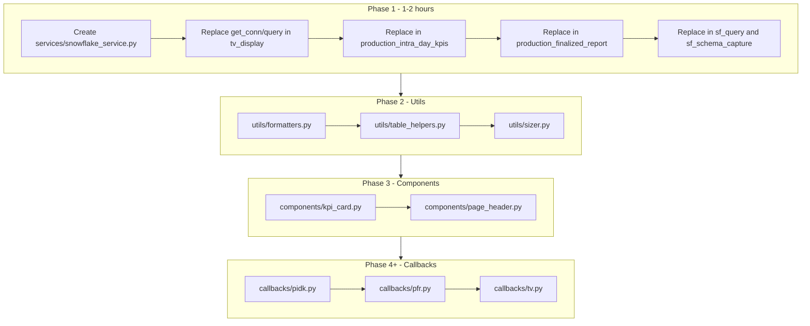

# HUGE DASH REFACTOR PLAN v2 - LIGHT AND READY

---

## Q1: Current Codebase Health Report

### File inventory and line counts


| File                                                                         | Lines | Purpose                      |
| ---------------------------------------------------------------------------- | ----- | ---------------------------- |
| [app.py](app.py)                                                             | 106   | Main entry, navbar, layout   |
| [pages/home.py](pages/home.py)                                               | 12    | Static home                  |
| [pages/tv_display.py](pages/tv_display.py)                                   | 517   | TV dashboard (5-min refresh) |
| [pages/production_intra_day_kpis.py](pages/production_intra_day_kpis.py)     | 1,525 | PIDK report                  |
| [pages/production_finalized_report.py](pages/production_finalized_report.py) | 1,061 | PFR + PDF/ZIP                |
| [scripts/sf_query.py](scripts/sf_query.py)                                   | 41    | CLI query helper             |
| [scripts/sf_schema_capture.py](scripts/sf_schema_capture.py)                 | 165   | Schema capture               |


### Duplication summary


| Pattern                           | Locations                                                                             | Severity |
| --------------------------------- | ------------------------------------------------------------------------------------- | -------- |
| `get_conn()`                      | tv_display, production_intra_day_kpis, production_finalized_report, sf_schema_capture | Critical |
| `query(sql)`                      | tv_display, production_intra_day_kpis, production_finalized_report, sf_query          | Critical |
| `color_bar_powerbi` / `color_bar` | tv_display (L124-148), production_intra_day_kpis (L85-97)                             | Medium   |
| `_normalize_cell_color`           | tv_display (L152), production_intra_day_kpis (L117)                                   | Medium   |
| `build_sizer_matrix`              | production_intra_day_kpis, production_finalized_report                                | High     |
| Back arrow + header layout        | tv_display, production_intra_day_kpis, production_finalized_report                    | Medium   |


### Layout vs callbacks vs data mixing


| File                           | Layout | Callbacks | Data/helpers | Mixing                              |
| ------------------------------ | ------ | --------- | ------------ | ----------------------------------- |
| app.py                         | Yes    | 1         | None         | Clean                               |
| tv_display.py                  | ~55    | 2         | ~300         | `_build_tv_payload` mixes data + UI |
| production_intra_day_kpis.py   | ~165   | 17        | ~1,200       | Heavy mixing                        |
| production_finalized_report.py | ~50    | 4         | ~1,000       | `render_report` mixes data + UI     |


**Refactor score: 4/10**

---

## Q2: Ideal New Project Structure

```
dashapp/
├── app.py
├── server.py                    # gunicorn entry: server = app.server
├── config/
│   __init__.py
│   settings.py                  # Env loading, optional
├── services/
│   __init__.py
│   snowflake_service.py         # Plain connector + context manager
├── utils/                       # Phase 2+
│   formatters.py
│   table_helpers.py
│   sizer.py
├── components/                  # Phase 2+
│   kpi_card.py
│   page_header.py
├── callbacks/                   # Phase 3+
│   navbar.py
│   tv.py
│   pidk.py
│   pfr.py
├── pages/
│   home.py
│   tv_display.py
│   production_intra_day_kpis.py
│   production_finalized_report.py
├── assets/
├── scripts/
├── requirements.txt
├── Procfile
├── gunicorn.conf.py
├── Makefile
└── README.md
```

---

## Q3: Shared Data Layer - Lightweight Snowflake Service

**Design:** `services/snowflake_service.py` uses only `snowflake.connector`, a context manager, and per-request connections. No global shared connection. Safe for gunicorn because each request opens and closes its own connection.

**Why context manager (not global conn):**

- Gunicorn workers are separate processes; a global conn in one worker is not shared across workers.
- A long-lived conn can expire (Snowflake token/session). Per-request connections avoid stale connections.
- Context manager guarantees `conn.close()` even on errors.

**Full implementation:**

```python
# services/snowflake_service.py
"""Lightweight Snowflake service. Uses snowflake.connector + context manager.
No SQLAlchemy. Token auth. Safe for gunicorn: per-request connections, no global shared conn.
"""
from contextlib import contextmanager
import os
import pandas as pd
import snowflake.connector

@contextmanager
def get_connection():
    conn = snowflake.connector.connect(
        account=os.getenv("SNOWFLAKE_ACCOUNT"),
        user=os.getenv("SNOWFLAKE_USER"),
        authenticator="programmatic_access_token",
        token=os.getenv("SNOWFLAKE_TOKEN"),
        warehouse=os.getenv("SNOWFLAKE_WAREHOUSE"),
        database=os.getenv("SNOWFLAKE_DATABASE"),
        schema=os.getenv("SNOWFLAKE_SCHEMA"),
        network_timeout=30,
        login_timeout=30,
    )
    try:
        yield conn
    finally:
        conn.close()

def query(sql: str) -> pd.DataFrame:
    with get_connection() as conn:
        cursor = conn.cursor()
        cursor.execute(sql)
        cols = [d[0] for d in cursor.description]
        rows = cursor.fetchall()
    return pd.DataFrame(rows, columns=cols)
```

**Migration:** Replace `get_conn()` + `query()` in each page with:

```python
from services.snowflake_service import query
# Remove get_conn(), _conn, and local query(); use query("SELECT ...")
```

**sf_query.py:** Change to `from services.snowflake_service import query` (no local `query`).

---

## Q4: Callback Architecture Overhaul

**Pattern:** Move callbacks into `callbacks/<feature>.py`; import them in `app.py` after layout so they register with the app.

```python
# app.py (after app.layout = ...)
import callbacks  # noqa: F401 - registers all callbacks
```

```python
# callbacks/__init__.py
from callbacks import navbar, tv, pidk, pfr  # noqa: F401
```

Pages keep only `layout` and `dash.register_page`. Callbacks reference output/input IDs defined in page layouts. Phase 4+ work.

---

## Q5: Smooth 5-Minute Realtime Dashboard - Zero Flicker

**Current state:** TV already uses `dcc.Interval(300_000)`, `dcc.Store`, background thread cache, and `dcc.Loading` on the header area only (not main block). This is already close to best practice.

**Improvements:**

1. **dcc.Loading placement:** Keep Loading only on header/dropdown (current). Do NOT wrap `tv-main-block`; wrapping main content causes full-page flash on every interval tick.
2. **Patch() usage:** For TV, the main block is rebuilt from a cached payload. Figure updates are full replacements. `Patch()` helps when only small parts change (e.g., annotation text). For KPI cards + charts, full replacement from cache is fine; the cache ensures no extra Snowflake calls on interval, so updates are fast and smooth.
3. **Animation:** Add `transition` to figure layout for smoother replot:

```python
   fig.update_layout(transition={"duration": 200})
   

```

1. **Store strategy:** Keep `tv-date-store` for dropdown sync. The in-memory `_tv_cache` + background thread keeps TODAY warm. On interval fire, callback returns from cache without blocking.
2. **Before/after:** Before = callback hits cache or builds payload (blocking). After = same, but ensure Loading never wraps main block; add `transition` to charts.

---

## Q6: Reusable Components and Layouts

- `components/kpi_card.py` - `kpi_card(title, value, goal, delta_pct, color, ...)` (already in tv_display, extract)
- `components/page_header.py` - `page_header(title, back_href, right_slot)` for back + title + dropdown

Phase 2+.

---

## Q7: Performance and Caching Strategy

- **TV/PIDK:** Keep in-memory cache + background thread (current).
- **diskcache:** Add later for heavy PFR queries if needed.
- **Background callbacks:** For PDF/ZIP generation, consider `@callback(..., background=True)` with DiskcacheLongCallbackManager to avoid timeouts.
- **Snowflake:** Use `USE_CACHE`, warehouse sizing, materialized views for heavy joins.

---

## Q8: Production Deployment Stack (Self-Hosted + Cloudflare)


| Step | File/action                                                                                           |
| ---- | ----------------------------------------------------------------------------------------------------- |
| 1    | `server.py`: `from app import app; server = app.server`                                               |
| 2    | `gunicorn.conf.py`: `bind = "unix:/run/dashapp/dashapp.sock"`, workers=4, timeout=120                 |
| 3    | Nginx: reverse proxy to socket, gzip, `proxy_http_version 1.1`, `Upgrade`/`Connection` for WebSockets |
| 4    | systemd `dashapp.service`: `ExecStart=gunicorn -c gunicorn.conf.py server:server`, `Restart=always`   |
| 5    | `mkdir /run/dashapp`, `/var/log/dashapp`; chown www-data                                              |
| 6    | Cloudflare: DNS A record, proxy on; SSL Full; optional WAF/rate limiting                              |


---

## Q9: Phased Migration Roadmap (Realistic with Cursor)


| Phase | Tasks                                                                                                                                | Time      | Stop and commit                                  |
| ----- | ------------------------------------------------------------------------------------------------------------------------------------ | --------- | ------------------------------------------------ |
| **1** | Create `services/`, `snowflake_service.py`; migrate all `query()` calls; remove `get_conn` from pages + sf_query + sf_schema_capture | 1-2 hours | All pages use `services.snowflake_service.query` |
| **2** | Create `utils/` (formatters, table_helpers, sizer); extract duplicates                                                               | 2-3 hours | No duplicated helpers                            |
| **3** | Extract components (kpi_card, page_header); refactor TV layout                                                                       | 2 hours   | TV uses components                               |
| **4** | Split PIDK: callbacks/pidk.py, services/pidk_data.py                                                                                 | 4-6 hours | PIDK page < 200 lines                            |
| **5** | Split PFR                                                                                                                            | 3-4 hours | PFR page < 150 lines                             |
| **6** | Zero-flicker tweaks (Loading, transition)                                                                                            | 30 min    | Visual verification                              |
| **7** | Prod stack: server.py, gunicorn, nginx, systemd                                                                                      | 2-3 hours | App runs via systemd                             |


---

## Q10: Security, Monitoring and Ops Checklist

- Secrets in `.env`, never committed
- Snowflake key-pair auth (future)
- Cloudflare rate limiting
- Structured logging (e.g., JSON)
- Optional Prometheus `/metrics`
- `.env` backup in secret store

---

## Q11: Bonus Polish and Future-Proofing

- Theme toggle: `dcc.Store("theme")` + swap DARKLY/FLATLY
- Error boundaries / custom error page
- pytest + dash.testing
- GitHub Actions: lint, test, deploy

---

## Q12: One-Command Dev vs Prod Scripts

```makefile
.PHONY: dev prod-test deploy install

install:
	pip install -r requirements.txt

dev:
	python app.py

prod-test:
	gunicorn -c gunicorn.conf.py server:server --bind 127.0.0.1:8050

deploy:
	git pull && pip install -r requirements.txt
	sudo systemctl restart dashapp
```

---

## Next Action Prompt (Phase 1)

Use this prompt after completing Phase 1:

> **Phase 1 Complete - Next: Phase 2 (Utils and Components)**
>
> Phase 1 is done: `services/snowflake_service.py` exists and all pages/scripts use it. Now:
>
> 1. Create `utils/formatters.py` with `_fmt`, `_fmt_num`, `_fmt_dt`, `_safe_str`.
> 2. Create `utils/table_helpers.py` with `color_bar_powerbi`, `color_bar`, `_normalize_cell_color`, `_normalize_df_columns`.
> 3. Create `utils/sizer.py` with `_size_sort_key`, `_get_gradient_color`, `build_sizer_matrix`.
> 4. Replace all duplicated usages in tv_display, production_intra_day_kpis, and production_finalized_report with imports from utils.
> 5. Run the app and verify TV, PIDK, and PFR still work. Stop and commit after Phase 2.

---

## Architecture Overview




