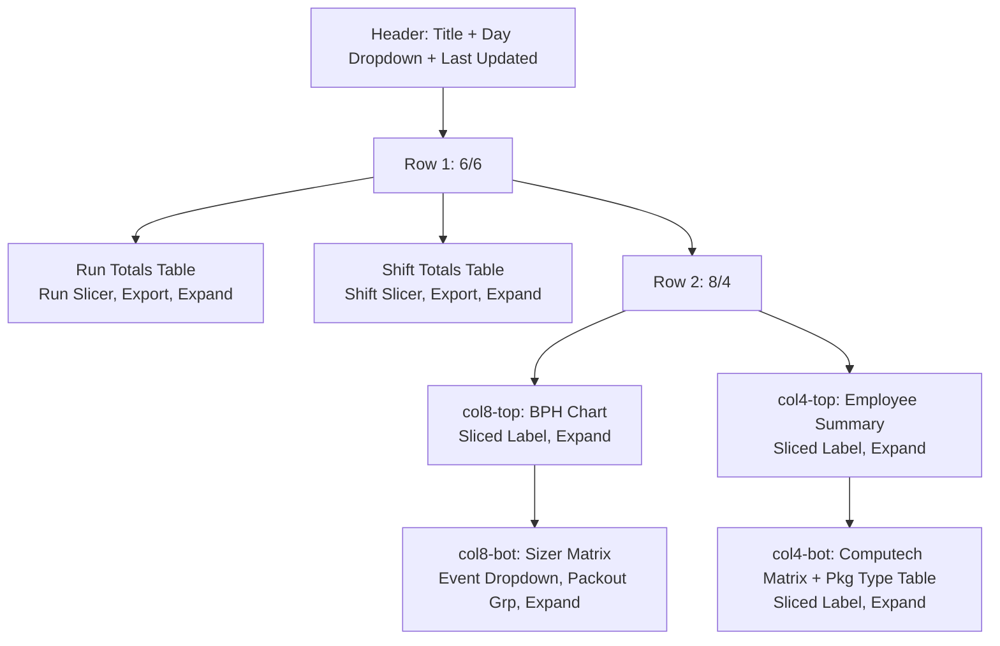

# Golden Production KPI Page Outline
*Last Updated: 2026-03-02*

This is the **comprehensive, canonical reference** for building new production KPI pages like `/production/intra-day-kpis`. Derived from the golden implementation: [`pages/production_intra_day_kpis.py`](pages/production_intra_day_kpis.py), [`services/pidk_data.py`](services/pidk_data.py), [`callbacks/pidk.py`](callbacks/pidk.py).

Use this **verbatim** for new pages (e.g., `/production/run-efficiency`). Deviations require updating this doc + `.cursor/rules/002-golden-backend-pattern.mdc`.

## 🎯 Page Goals & Guarantees
- **UX**: Dark theme (#1a1a1a), responsive dbc Cards, blue accents (#64B5F6), loaders, slicers, expand/fullscreen tiles, CSV export, sliced labels.
- **Perf**: Cache-first (TODAY: 5min refresh), live queries fallback, &lt;5s loads, filter-local (no full reload).
- **Structure**: Layout (page), Data (service), Callbacks (separate); 6-tile grid.
- **Extensibility**: Add tiles via `_TILE_IDS`; cache payload dict.

## 📋 Layout Diagram


## 1. Agree Assumptions (Checklist)
```
Slug: {slug} (e.g., runeff)
Path: /production/{kebab-case}
Name: Production {Title Case} KPIs
Day Options: TODAY, YESTERDAY, ...
Slicers: Run/Lot (global), Shift (global)
Tiles (order fixed):
1. Run Totals (table)
2. Shift Totals (table)
3. BPH Chart (line/bar by grower)
4. Sizer/Event Matrix (dropdowns)
5. Employee Summary (table)
6. EQ/Computech Matrix (pkg filter + sub-table)
KPIs: List columns (e.g., BINS, HOURS, EMPLOYEES)
Filters: Confirm dropdowns per tile
Data Views: {slug}_run_totals, {slug}_shift_totals, ...
```

## 2. dbt Models
**Path**: `dbt/models/marts/production/{slug}_*.sql`

**Template**:
```sql
-- models/marts/production/{{ var('slug') }}_run_totals.sql
{{ config(materialized='view') }}

WITH data AS (
  SELECT ...
  FROM {{ ref('upstream') }}
  WHERE pack_date = {{ day_label_filter() }}  -- Macro for day_label
)
SELECT
  RUN_KEY, PACKDATE_RUN_KEY, LOT, RUN, SHIFT,
  SUM(bins) AS total_bins, AVG(hours) AS avg_bph, ...
FROM data
GROUP BY 1,2,3,4,5
```

**Deploy**:
```powershell
.\scripts\run_dbt.ps1 run --select +marts.production.{slug}
```

## 3. Services: `services/{slug}_data.py`
**Template Skeleton**:
```python
&quot;&quot;&quot;
{Title} KPIs - Data layer.
&quot;&quot;&quot;
import pandas as pd
from services.snowflake_service import query
from utils.table_helpers import _normalize_df_columns

RUN_COL_MAP = {&quot;RUN_KEY&quot;: [&quot;run_key&quot;, &quot;RUN_KEY&quot;], ...}
SHIFT_COL_MAP = {...}

def get_day_label_options():
    return [{&quot;label&quot;: &quot;TODAY&quot;, &quot;value&quot;: &quot;TODAY&quot;}, ...]

def get_run_totals(day_label):
    sql = f&quot;&quot;&quot;
    SELECT * FROM {DBT_SCHEMA}.{slug}_run_totals WHERE day_filter = '{day_label}'
    &quot;&quot;&quot;
    return query(sql)

# Chart: get_bph_data(day_label, lot=None, run_key=None)
# build_bph_chart(grower_dfs: list[tuple[lot, df]]) -> go.Figure

# Tables: build_run_totals_table(df) -> html.Div[ag-grid]
# Helpers: filter_events_by_run(...), aggregate_drops(...)

# Cache Payload Keys: 'run_data', 'shift_data', 'bph_data={(pk,lot):df}', 'sizer_events_full', ...
```

## 4. Layout: `pages/production_{kebab}.py`
**Reference**:

```14:60:pages/production_intra_day_kpis.py
dash.register_page(__name__, path=&quot;/production/intra-day-kpis&quot;, name=&quot;Production Intra Day KPIs&quot;)

# Header + stores + dbc.Container[ page_header(title, '/', dropdown+updated), Rows/Cols/Cards ]
```

**Key Patterns**:
- IDs: `{slug}-{component}` (e.g., `pidk-run-totals-table`)
- Classes: `{slug}-root`, `-tile-wrapper`, `-table-card`, `-card-header-centered`
- Expand: `id={&quot;type&quot;: &quot;{slug}-expand-btn&quot;, &quot;index&quot;: &quot;run-totals&quot;}`

## 5. Callbacks: `callbacks/{slug}.py`
**Reference**:

```47:107:callbacks/pidk.py
@callback(Outputs..., Inputs(interval, day_store, selected_run/shift/event/packout/pkg))
def update_{slug}_all(...):
    cached = get_cached_data(&quot;{slug}&quot;, day_label)
    # Filter, build tables/figs, opts, labels
    return tuple(18 outputs)
```

**Required Callbacks** (10 total):
1-2. Defaults/resets
3-5. Expand toggle/class/icon
6-7. Slicer → store updates
8. Main update_all
9. Export CSV
10-11. Pkg filter toggle/reset

**Helpers**: `_filter_run_rows(...)`, fallbacks, `_get_row_val(row, *case_insens_keys)`

## 6. Deployment & Testing
1. Files created → `python app.py` (auto-registers, warms cache)
2. Visit URL → Check: visuals, interactions, console (cache hits), 5min refresh
3. Lint: No new errors
4. Edge: No data → gray &quot;No data&quot;; Error → yellow &quot;Error...&quot;

## 🚀 Quick-Start Command
```
# In Cursor Agent: &quot;Build new page /production/{kebab} following golden outline&quot;
```

*Forked from PIDK; update on changes.*
